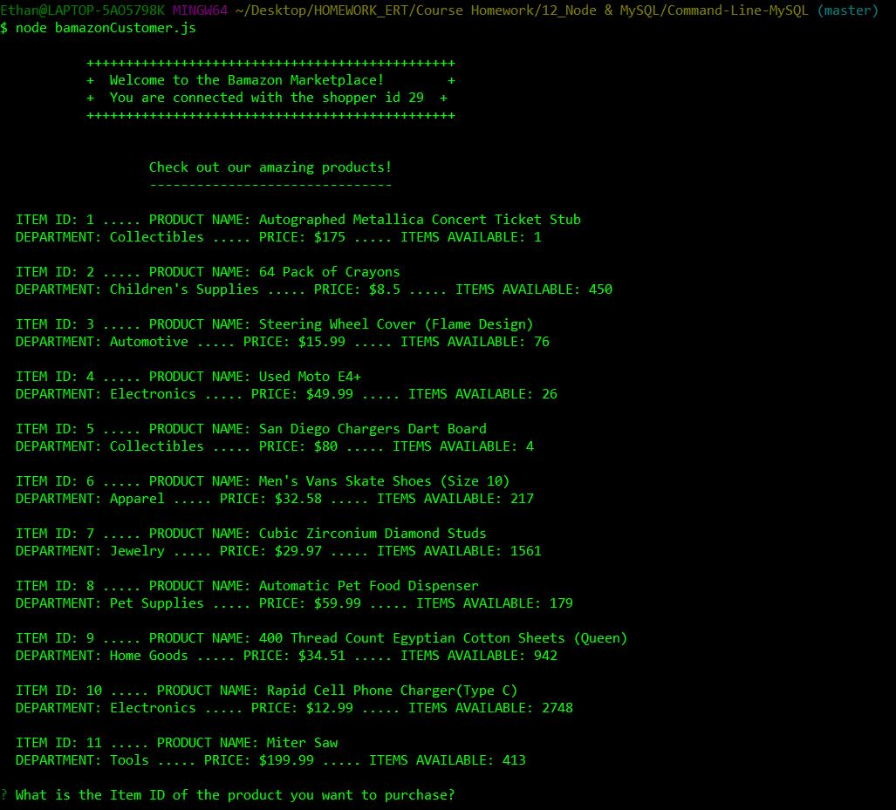
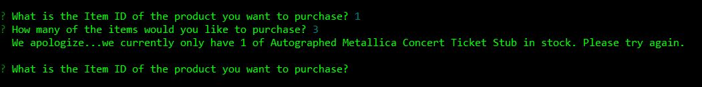
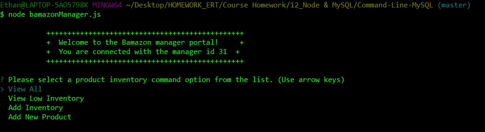
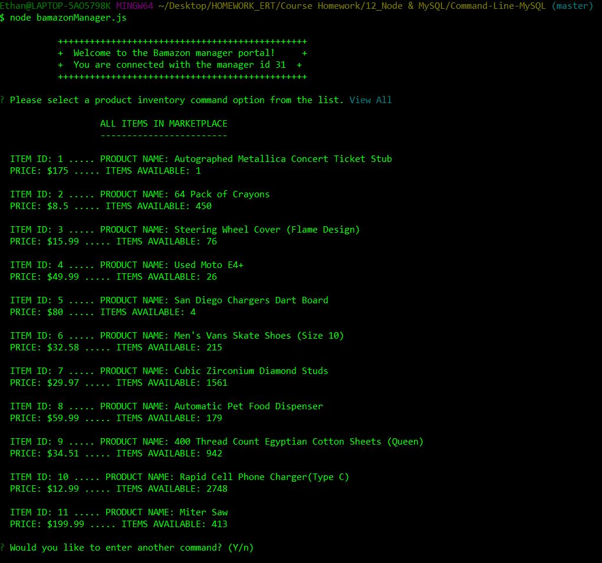
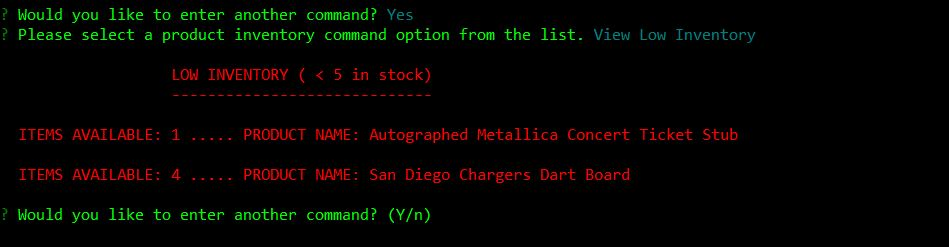
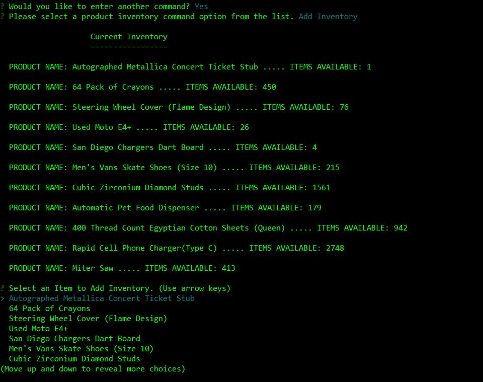
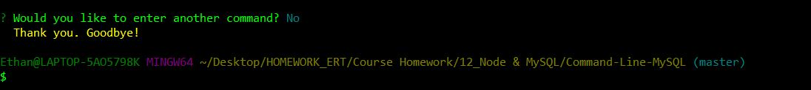

### An Amazon-style storefront that takes orders from users and adjusts inventory in a database

#### The Bamazon Marketplace is a program written in JavaScript that runs solely in the command line, pulling data from a local MySQL database.
#### Users can run the Bamazon Customer file to view inventory, select and 'purchase' an item.
#### Users can run the Bamazon Manager file to view inventory, check low inventory, add stock, or add a new item.

#### Both files connect to a local MySQL database and table, which is updated based on the actions taken by the user in the comman line.

#### Languages/Technologies Used
* JavaScript
* Node.js
* Inquirer (npm)
* Colors (npm)
* MySQL server

#### Below you can see screenshot examples of the functionality of the different commands.

## Customer File:

### View all items &#9660;

### Attempted purchase, but insufficient inventory &#9660;

### Successful purchase with total amount paid &#9660;

### Updated table of items after user purchase &#9660;

## Manager File:

### Initial menu options &#9660;

### View all items &#9660;

### View low inventory (less than 5 items in stock) &#9660;

### Add inventory menu &#9660;

### Inventory successfully added message &#9660;

### Add new item &#9660;

### New item in menu &#9660;

### Exit message &#9660;
